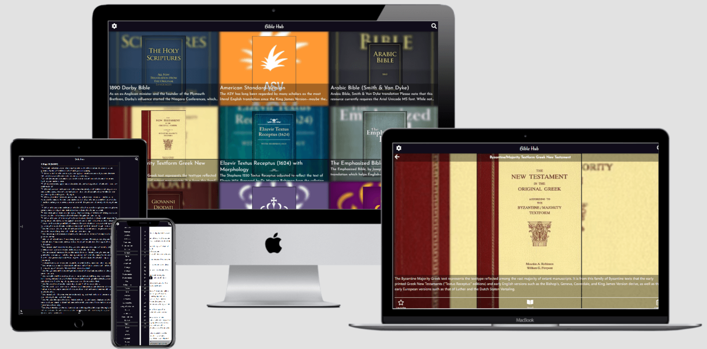
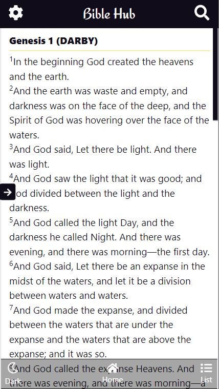
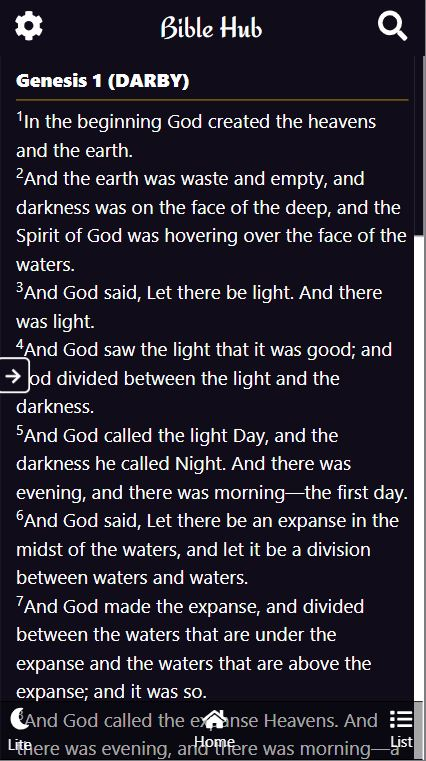

# Bible Hub

> Bible Hub is a single page application (SPA) that helps users get more than 25 different bible languages and versions and read each individual bible content verse by verse. 

## Live Demo

[click to view a live demo of the project](https://bible-hub.netlify.app/)

## Project Specification

[The project specification can be found here](https://www.notion.so/microverse/Catalogue-of-Recipes-ea589778a95f47fa98034d99d4016d2b)

## Sample Screenshots

#### Home

#### Lite Mode reading

#### Dark Mode reading


## Built With

- React
- Javascript
- Redux
- redux-thunk
- jest
- eslint
- stylelint
- bootstrap
- css
- html
- html-react-parser
- prop-types
- Fontawesome 
- 
### Setup

Clone the repo with

```
  git clone https://github.com/Berabjesus/Bible-Hub.git
```

Install packages with

```
  npm i
```

Start server with:

```
  npm start
```

The app wil open in your default browser.


## Test
To run tests, run `npm test`. Make sure the dependencies installed successfully before running tests

## Author

👤 **Bereket Beshane**

- Github: [@Berabjesus](https://github.com/Berabjesus)
- Twitter: [@bereket_ababu_b](https://twitter.com/bereket_ababu_b)
- Linkedin: Linkedin: [linkedin](https://www.linkedin.com/in/bereketbeshane/) 

## 🤝 Contributing

Contributions, issues and feature requests are welcome!

Feel free to check the [issues page](issues/).

## Show your support

Give a ⭐️ if you like this project!

## Acknowledgments

- [https://biblia.com/](https://biblia.com/)
- Marc-Antoine Roy for the design inspiration
- [Microverse](https://www.microverse.org) 

## 📝 License

This project is [MIT](lic.url) licensed.

